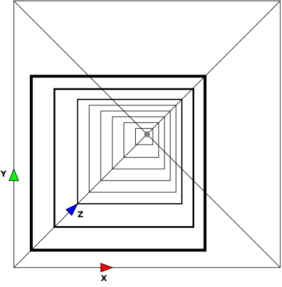
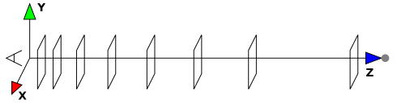
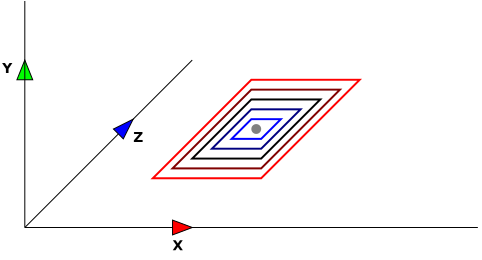
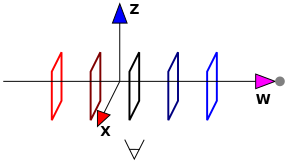

# Snake4D

Play in Web [here](https://eugeneko.github.io/Snake4D/Snake4D.html)

## Introduction

**Snake4D** is classic snake game in the mathematically correct 4D world.
This app is closer to proof-of-the-concept for 4D gameplay, rendering and animation than to actual playable game.

Important notes:

- When the game is started, it starts playing AI demo automatically.
Go to menu to try playing the game itself.

- I strongly recommend to have at least basic understanding of 4D geometry.
There are a lot of videos and articles written by people who are better at explaining things than me,
so I skip common knowledge in this document.

- Yes, the game becomes messy when the snake grows.
Nothing to do here, 4D just have insanely big information density after projecting on 2D screen.
There may be up to 14640 (!) snake tail segments in the game world.
There's just no way one can nicely fit this much geometry on the screen.

- This game is not really designed to be playable by a human being.
I cannot play it beyond certain snake length. You won't be able too.
I guess that's why 4D games aren't made that often.

## Graphics

4D graphics mostly follows the same rules as 3D.
There are 4 orthogonal axes in 4D:

- **X** and **Y** are the standard 2D axes of the screen. **X** goes left to right and **Y** goes bottom to top.

- **Z** is the standard 3rd axis that goes "forward" from the eyes of the spectator into the screen.

- **W** is the 4th axis that doesn't have specific direction in 3D world.

Before I explain 4D-to-3D projection, I want to say a few words about classic 3D-to-2D perspective projection.

When **3D** world is projected on **2D** surface (e.g. display), **Z** axis is folded by perspective projection.
As the object moves along **Z** axis away from the camera,
its **2D** projection becomes smaller and smaller, approaching the vanishing point.
The vanishing point is **2D** position on the screen, usually in the center.

**Figure 1:** the set of parallel square frames along **Z** axis from different points of view.
Gray dot is the vanishing point at **Z** coordinate approaching infinity.

In order to project from 4D to 3D, **W** axis is also folded using similar algorithm.
The vanishing point is in **3D** now, and as the object moves along **W** axis away from the camera,
its **3D** projection also becomes smaller and smaller, approaching the vanishing point in **3D**.

The only difference is that 4D-to-3D projection works in both directions.
While 3D-to-2D projection usually makes the objects behind the camera invisible, it's not the case for 4D-to-3D projection.
There's no way to reasonably define "behind" for **W** axis.

Therefore, when the **4D** object moves away from the camera in one (arbitrarily picked) direction along **W** axis,
it becomes smaller and approaches the vanishing point in **3D**.

When the **4D** object moves away from the camera in the opposite direction along **W** axis,
it becomes bigger and runs away from the vanishing point in **3D**.

**Figure 2:** the set of parallel square frames along **W** axis from different points of view.
Gray dot is the vanishing point at **W** coordinate approaching infinity.

In the end, 4D world is projected two times.
First, custom 4D-to-3D projection that folds **W** axis.
Second, commonly used 3D-to-2D perspective projection that folds **Z** axis too.

In order to make different positions along **W** axis more distinguishable,
objects are colored differently according to their positions.

Objects with the same **W** coordinate as the camera have default colors (e.g. white for snake body, green for food).
Objects with positive or negative offset in **W** coordinate have **blue** or **red** tint in their color.

The directions along **W** axis are named **red** and **blue** according to their color tint.

The camera is attached to the center of the snake head.
The "vanishing point" for 4D-to-3D projection is located there too.

Therefore, objects at the same **W**-level as the snake head are white
(or slightly red and blue simultaneously due to their non-zero size).

Objects at the different **W**-level than the snake head have distinct blue **or** red tint.
They are also shifted to/from snake head due to projection,
so their real position may be significantly different from their apparent projected position.

## Movement

Movement has the same nature in **3D** and in **4D**.

When camera rotates in **3D**, two axes trade places and the third axis stays fixed.

When camera rotates in **4D**, two axes trade places and two remaining axes stay unchanged.

W/A/S/D control snake movement in **3D**, ignoring 4th dimension.
Q/E/Space control how 4th dimension is projected into 3D space.

- **W** and **S** rotate snake **up** and **down**.
Both **X** and **W** axes stay the same, **Y** and **Z** axes trade places.
This is classic 3D rotation.

- **A** and **D** rotate snake **left** and **right**.
Both **Y** and **W** axes stay the same, **X** and **Z** axes trade places.
This is classic 3D rotation too.

- **Q** and **E** rotate snake **red** and **blue**.
Both **X** and **Y** axes stay the same, **Z** and **W** axes trade places.

  Note that left stays left, right stays right, up stays up, and down stays down.
However, forward direction and color direction trade places, causing re-projection.
Everything that was folded into red and blue, unfolds from back to front.
Everything that was stretched from back to front, folds into red and blue.

- **Space** aka **Roll** doesn't change the direction of the snake movement.
Instead, it switches **X** and **W** axes, causing re-projection.
Snake continues moving in the same direction. Up stays up.
Everything that was folded into red and blue, unfolds from left to right.
Everything that was stretched from left to right, folds into red and blue.

## Gameplay

There are three game modes:

- Classic aka *New Game!*: game as it is. Controls are completely unrestricted.

- *Tutorial*: Sandbox for ones learning how to play the game (for whatever reason). Controls are restricted to recommended best action (according to AI), the rest of user input is ignored.

- *Demo*: AI plays the game. Controls are disabled. Game always starts in *Demo* mode on launch.

Gameplay basics:

- **The world** is the hypercube with 11x11x11x11 hypercube cells inside.

- **The wall** is the boundary of the world covered with gray quads.
Only walls of the current 3D slice of 4D space are displayed.

- **Snake tail** are red-to-white-to-blue hypercube frames connected to each other and to the head.

- **Snake head** is the yellow hypercube frame in the center of the screen.
If snake head hits the wall, snake dies.
If snake head hits its tail, snake dies.

- **Snake food** aka **target** is the green rotating hypercube frame.
When the food is eaten, snake grows by three segments.

- Unless snake performs **4D** rotation using Q, E or Space,
it cannot hit tail segments that have **red** or **blue** offset.
Segments with different coordinate along **W** axis may visually overlap
with each other or with the head due to 4D-to-3D projection.

- Beware! Re-projection due to **4D** rotation shifts the walls.
**red** or **blue** rotation shifts the forward wall which may lead to nearly instant death on high speeds.

- Small solid cubes going from the head of the snake are **the guidelines**.
In normal game, the guidelines show approximate path to the target and may go through the snake tail.
Blocked guideline elements are smaller than normal.
In tutorial game, guidelines never go through the snake tail,
although they may visually intersect it if the path was traced through another 3D slice of 4D world.

- Guidelines are not affected by 4D-to-3D perspective deformation and always match 3D grid.

- Guideline color shows whether the target is in the same 3D slice (green guideline), has **red** offset (orange guideline) or has **blue** offset (blue guideline).

Navigation is 4D is hard. Some tips:

- Navigate in 3D first. It's easier.

- If the target is straight ahead, but has **red** or **blue** offset,
just **roll** (by pressing **Space**). It will let you reach the target using only 3D navigation.

- Alternatively, if the target has exactly the same position as the head in **3D**, but has **red** or **blue** offset,
rotate **red** or **blue** and the target will be straight ahead.
